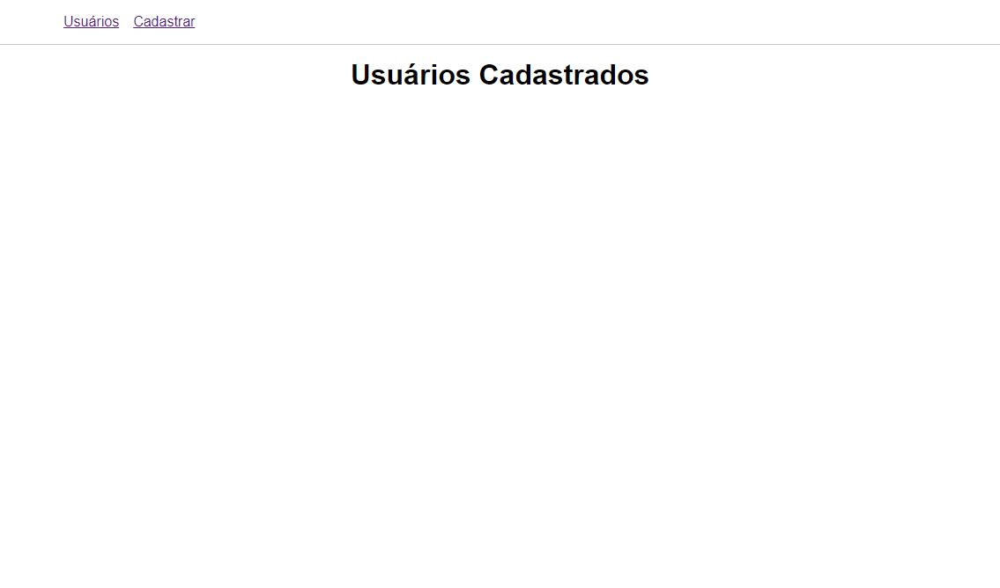

 

    

  <h3 align="center">Cadastro de usuário com NodeJS, Sequelize e PostgreSQL</h3>
  
  

     Sistema de cadastro de usuários
      

  <a href="#sobre"> Sobre </a> |
  <a href="#conhecimentos-praticados"> Conhecimentos praticados </a> |
  <a href="#rotas-da-aplicação"> Rotas da aplicação </a> |
  <a href="#tecnologias-utilizadas"> Tecnologias utilizadas </a>      
        
     
    <h1 align="center">
    
 </h1>
  

# Sobre
O objetivo do projeto foi criar um sistema de cadastro de usuários, com a finalidade de colocar em prática os conhecimentos em Node, Express e Sequelize que adquiri até o momento!

# Conhecimentos Praticados
✔ NodeJs  
✔ Express  
✔ Sequelize  
✔ CRUD com Sequelize  
✔ Relacionamentos com Sequelize  

# Rotas da aplicação:
<b>[GET] </b> / : A rota deverá mostrar todos os usuários cadastrados.  

<b>[GET] </b> /users/create : A rota deve exibir a formulário de cadastro de usuários.  

<b>[POST] </b> /users/create : A rota deve criar o usuário no banco de dados com os dados recebidos no corpo da requisição.  

<b>[GET] </b> /users/:id : A rota deve retornar as informações do usuário filtrando baseado no ID.  

<b>[GET] </b> /users/edit/:id : A rota deverá listar os dados do usuário a ser editado filtrando pelo ID.   

<b>[POST] </b> /users/update : A rota deve atualizar os dados do usuário baseado no ID   

<b>[POST] </b> /users/delete/:id : A rota deve deletar um user no banco baseado no ID   

<b>[POST] </b> /address/create : A rota deve adicionar um endereço a um usuário.  

<b>[POST] </b> /address/delete : A rota deve deletar um endereço no banco baseado no ID. 

# Tecnologias utilizadas: 

   

---
**Desenvolvido  por [Bruno Andreotti](www.linkedin.com/in/bruno-andreotti/).** 
